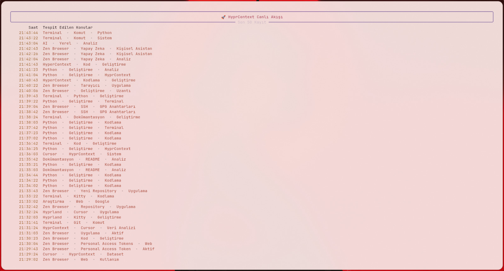
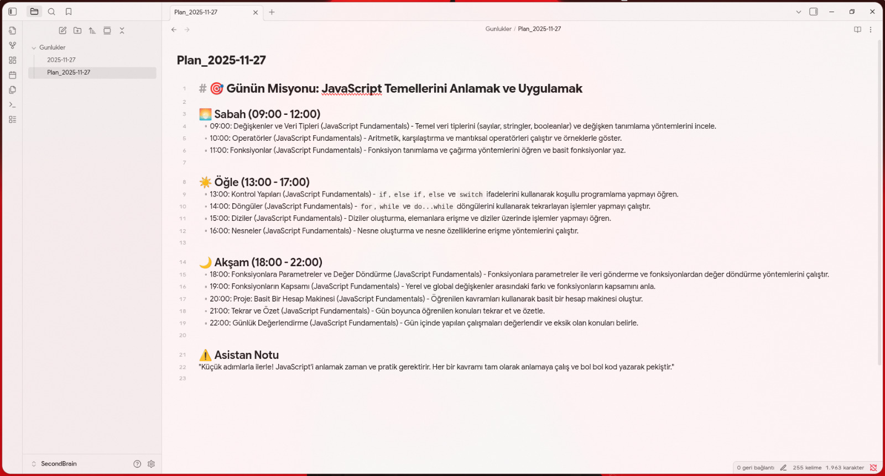
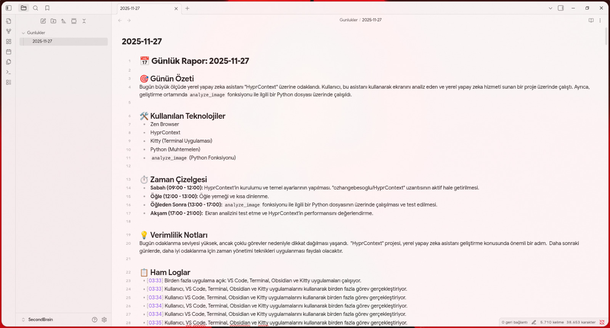
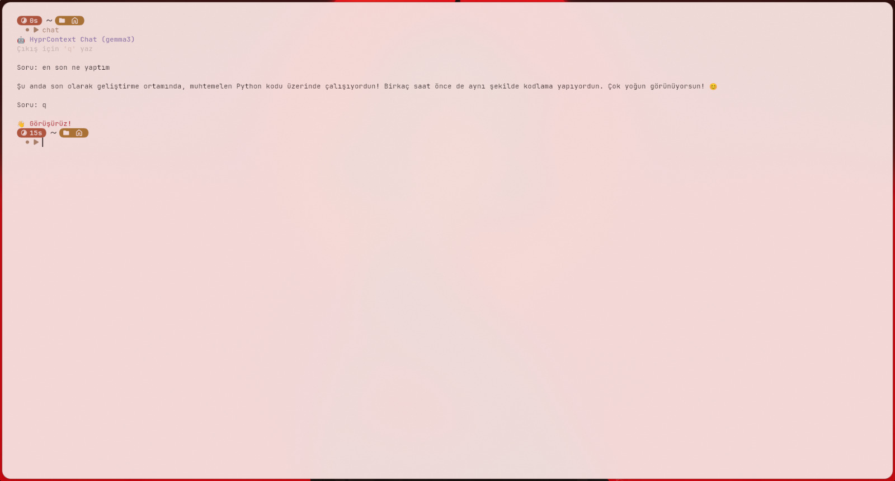
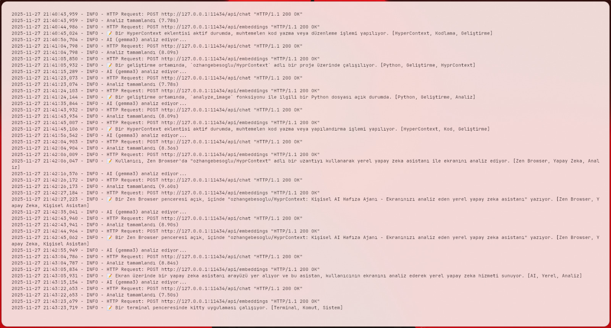
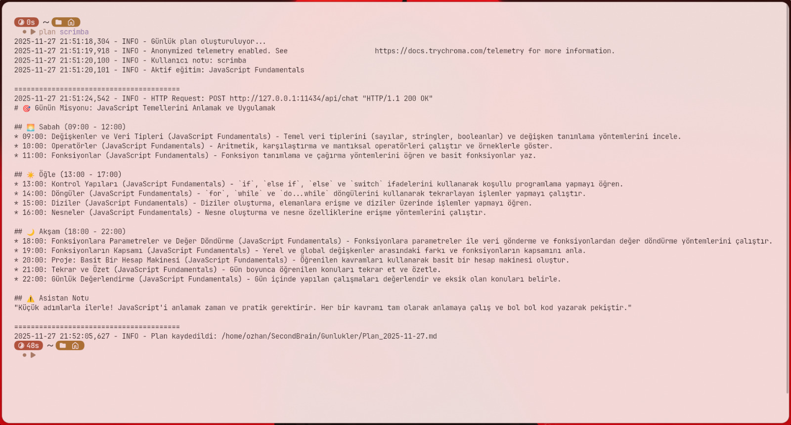
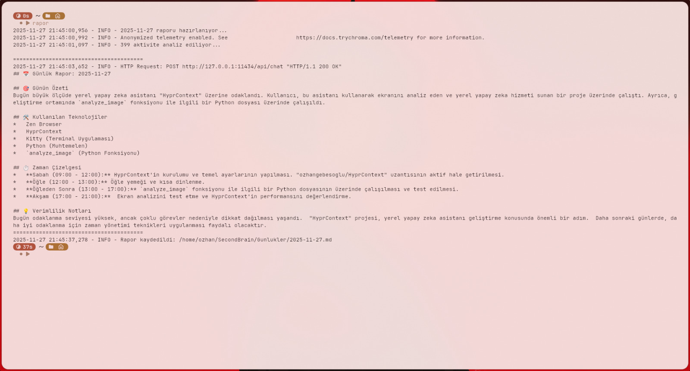
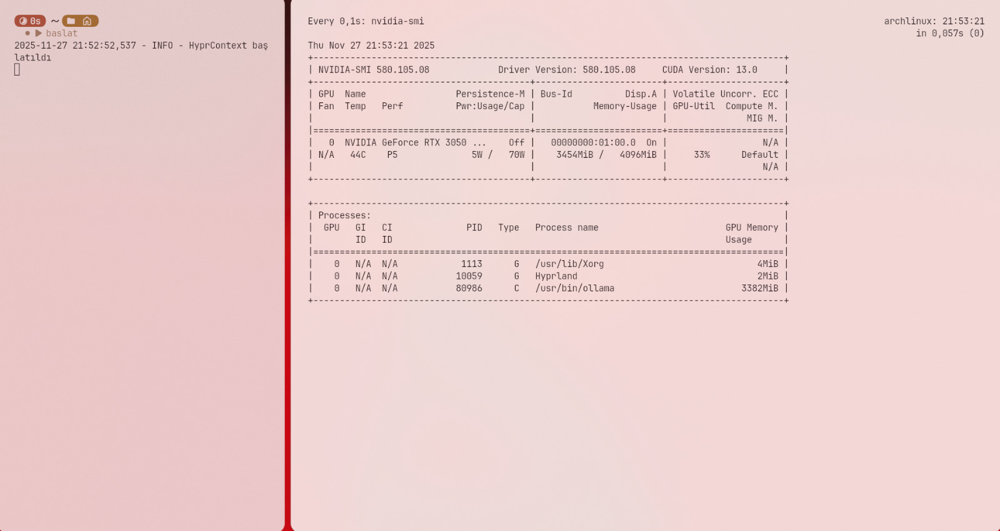

# 🧠 HyprContext

**Kişisel AI Hafıza Ajanı** - Ekranınızı analiz eden, aktivitelerinizi kaydeden ve size özel içgörüler sunan yerel yapay zeka asistanı.


## 📸 Ekran Görüntüleri

<details>
<summary>🖥️ Canlı Dashboard</summary>



</details>

<details>
<summary>📅 Günlük Plan (Obsidian)</summary>



</details>

<details>
<summary>📝 Günlük Rapor (Obsidian)</summary>



</details>

<details>
<summary>💬 Hafıza Sohbeti</summary>



</details>

<details>
<summary>⚡ Nasıl Çalışır (Loglar)</summary>



</details>

<details>
<summary>🎯 Plan Oluşturma (Terminal)</summary>



</details>

<details>
<summary>📊 Rapor Oluşturma (Terminal)</summary>



</details>

<details>
<summary>🖥️ GPU Kullanımı</summary>



</details>

## ✨ Özellikler

- 🖥️ **Ekran Analizi**: Periyodik ekran görüntüsü alıp AI ile analiz eder
- 🧠 **Vektör Hafıza**: ChromaDB ile semantik arama yapılabilir hafıza
- 📊 **Dashboard**: Terminal ve web tabanlı aktivite takibi
- 📅 **Günlük Planlama**: Geçmiş aktivitelere dayalı kişiselleştirilmiş günlük plan
- 📝 **Günlük Rapor**: Gün sonu aktivite özeti ve verimlilik analizi
- 💬 **Hafıza Sohbeti**: Geçmiş aktiviteleriniz hakkında soru sorun
- 🚨 **Odak Bekçisi**: Dikkat dağıtıcı aktiviteleri tespit edip uyarı verir

## 🏗️ Mimari

```
┌─────────────┐     ┌─────────────┐     ┌─────────────┐
│   grim      │────▶│   Gemma3    │────▶│  ChromaDB   │
│ (screenshot)│     │  (analiz)   │     │  (hafıza)   │
└─────────────┘     └─────────────┘     └─────────────┘
                           │
                           ▼
              ┌─────────────────────────┐
              │   Dashboard / Rapor     │
              │   Planner / Chat        │
              └─────────────────────────┘
```

## 📦 Gereksinimler

### Sistem
- Linux (Arch Linux önerilir)
- Hyprland (Wayland compositor)
- [Ollama](https://ollama.ai/) kurulu ve çalışır durumda

### Ollama Modelleri
```bash
ollama pull gemma3
ollama pull mxbai-embed-large
```

## 🚀 Kurulum

### 1. Repoyu klonla
```bash
git clone https://github.com/kullanici/HyprContext.git
cd HyprContext
```

### 2. Sanal ortam oluştur
```bash
python -m venv venv
source venv/bin/activate
pip install -r requirements.txt
```

### 3. Konfigürasyon
```bash
# .env dosyasını oluştur
cp .env.example .env
nano .env  # Ayarları düzenle

# Profil dosyasını oluştur
cp profile.yaml.example profile.yaml
nano profile.yaml  # Kendi bilgilerinizi girin
```

### 4. Sistem araçları (Arch Linux)
```bash
sudo pacman -S grim libnotify
```

## 🎮 Kullanım

### Ana Servis (Ekran İzleme)
```bash
python main.py
```

### Terminal Dashboard
```bash
python dashboard.py
```

### Web Dashboard
```bash
streamlit run web_dashboard.py
```

### Günlük Plan Oluştur
```bash
python planner.py
# veya not ekleyerek:
python planner.py "Bugün React öğreneceğim"
```

### Günlük Rapor
```bash
python daily_report.py
```

### Hafıza Sohbeti
```bash
python chat.py
```

## ⌨️ Shell Alias'ları (Önerilen)

`.bashrc` veya `.zshrc` dosyasına ekleyin:

```bash
# HyprContext Kısayolları
alias baslat="/path/to/HyprContext/venv/bin/python /path/to/HyprContext/main.py"
alias chat="/path/to/HyprContext/venv/bin/python /path/to/HyprContext/chat.py"
alias rapor="/path/to/HyprContext/venv/bin/python /path/to/HyprContext/daily_report.py"
alias plan="/path/to/HyprContext/venv/bin/python /path/to/HyprContext/planner.py"
alias dashboard="/path/to/HyprContext/venv/bin/python /path/to/HyprContext/dashboard.py"
```

Sonra:
```bash
source ~/.zshrc  # veya ~/.bashrc
```

Artık sadece `baslat`, `chat`, `rapor`, `plan`, `dashboard` yazarak kullanabilirsiniz!

## ⚙️ Systemd Servisi (Opsiyonel)

Arka planda otomatik çalışması için:

```bash
# ~/.config/systemd/user/hyprcontext.service
[Unit]
Description=HyprContext AI Memory Agent
After=graphical-session.target

[Service]
Type=simple
WorkingDirectory=/path/to/HyprContext
ExecStart=/path/to/HyprContext/venv/bin/python main.py
Restart=always
RestartSec=10

[Install]
WantedBy=default.target
```

```bash
systemctl --user enable hyprcontext
systemctl --user start hyprcontext
```

## 📁 Dosya Yapısı

```
HyprContext/
├── main.py              # Ana izleme servisi
├── dashboard.py         # Terminal UI
├── web_dashboard.py     # Streamlit web UI
├── planner.py           # Günlük plan oluşturucu
├── daily_report.py      # Günlük rapor oluşturucu
├── chat.py              # Hafıza sohbeti
├── config.py            # Merkezi konfigürasyon
├── database.py          # ChromaDB işlemleri
├── window_utils.py      # Hyprland yardımcıları
├── .env.example         # Örnek konfigürasyon
├── profile.yaml.example # Örnek kullanıcı profili
└── requirements.txt     # Python bağımlılıkları
```

## 🔧 Konfigürasyon

### .env Dosyası
```env
# Modeller
MODEL_VISION=gemma3
MODEL_EMBED=mxbai-embed-large

# Zamanlama
CAPTURE_INTERVAL=20  # saniye

# Odak Bekçisi
YASAKLI_KELIMELER=youtube,instagram,twitter,reddit,oyun,netflix
DISTRACTION_THRESHOLD=3

# Hava Durumu
WEATHER_CITY=Istanbul
```

### profile.yaml
Planner ve diğer modüller için kullanıcı profili. Eğitim programı, projeler, hedefler gibi bilgiler içerir.

## 🔒 Gizlilik

- Tüm veriler **yerel** olarak saklanır
- Hiçbir veri internete gönderilmez
- Ollama modelleri yerel çalışır
- Kişisel dosyalar `.gitignore`'da

## 📄 Lisans

MIT License

## 🤝 Katkıda Bulunma

Pull request'ler memnuniyetle karşılanır!

1. Fork edin
2. Feature branch oluşturun (`git checkout -b feature/amazing`)
3. Commit edin (`git commit -m 'Add amazing feature'`)
4. Push edin (`git push origin feature/amazing`)
5. Pull Request açın

