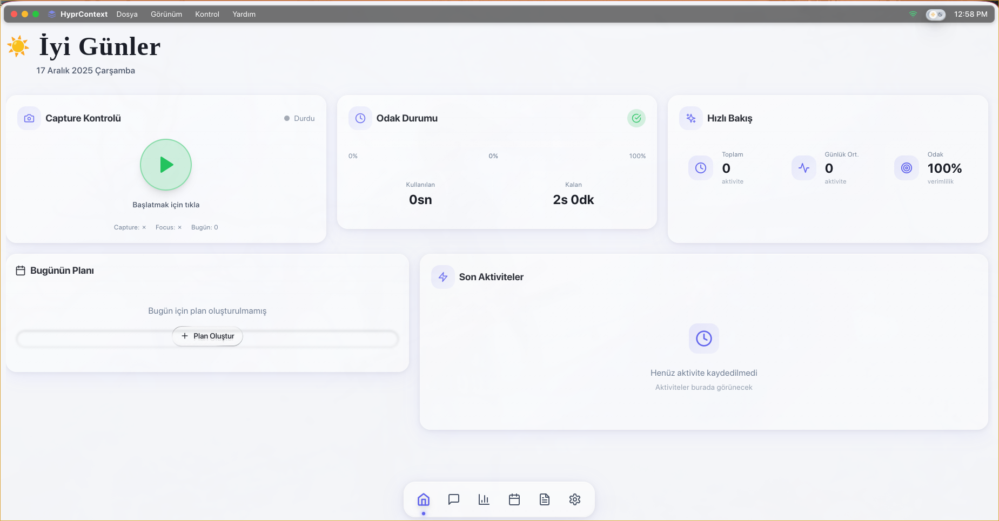
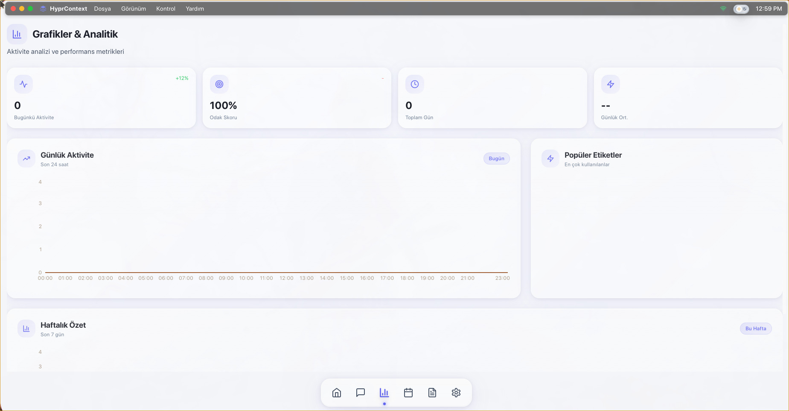
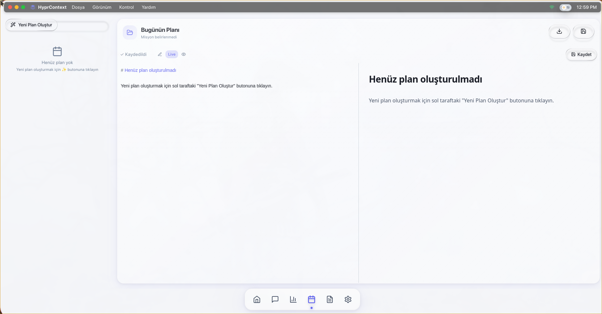
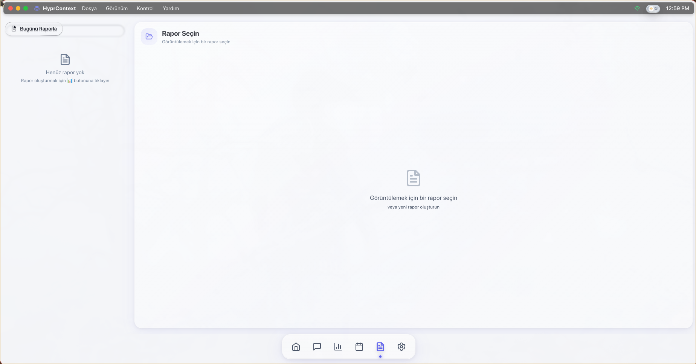
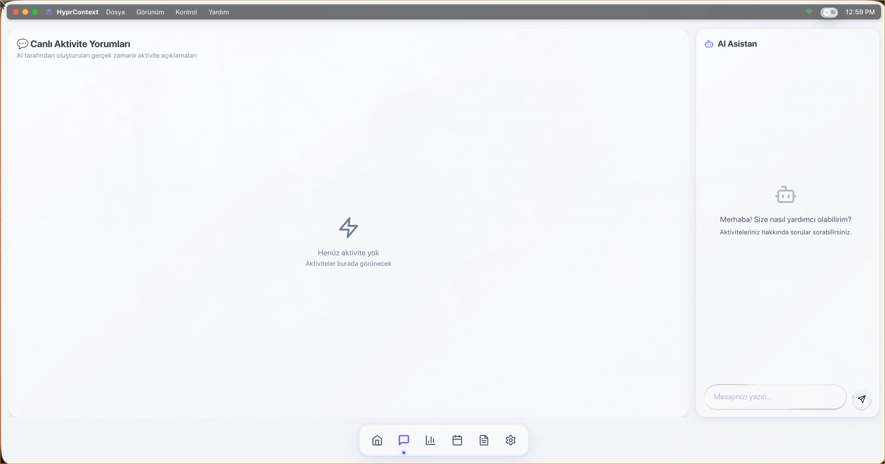
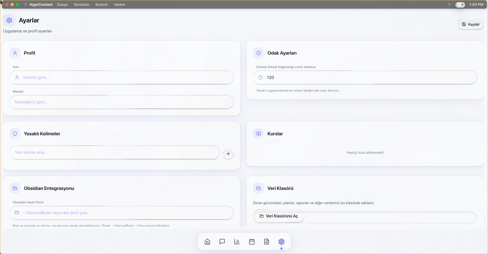
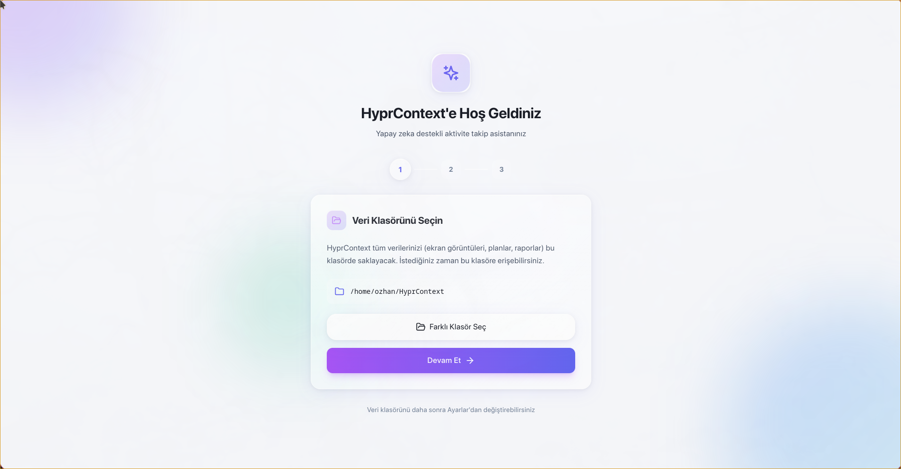

<p align="center">
  
</p>

<h1 align="center">HyprContext</h1>

<p align="center">
  <strong>AI-Powered Smart Productivity Tracking Assistant</strong>
</p>

<p align="center">
  <a href="https://github.com/ozhangebesoglu/HyprContext/releases"></a>
  <a href="LICENSE"></a>
  <a href="#"></a>
  <a href="#"></a>
</p>

<p align="center">
  <em>Privacy-focused desktop activity tracking application powered by local AI</em>
</p>

<p align="center">
  <a href="#-english">English</a> | <a href="#-türkçe">Türkçe</a>
</p>

---

# English

## What is HyprContext?

HyprContext is a desktop application that analyzes your computer activities using **local artificial intelligence** and helps you increase your productivity.

> **Privacy First**: All your data stays on your device. No cloud, no data sharing.

## Key Features

| Feature | Description |
|---------|-------------|
| **AI Analysis** | Local analysis with Ollama, no internet required |
| **Smart Tracking** | Screen analysis every 30 seconds |
| **Detailed Reports** | Daily, weekly activity summaries |
| **Plan Management** | AI-assisted daily planning |
| **Focus Mode** | Distraction app tracking |
| **AI Chat** | Ask questions about your activities |
| **Liquid Glass UI** | Modern, elegant glass-effect interface |

## Screenshots

<details>
<summary><strong>Show Screenshots</strong></summary>

| Home Page | Graphs |
|-----------|--------|
|  |  |

| Plans | Reports |
|-------|---------|
|  |  |

| Live Activity | Settings |
|---------------|----------|
|  |  |

| First Run Setup |
|-----------------|
|  |

</details>

---

## Quick Start (Linux)

### Requirements

- Linux (Arch, Fedora, Ubuntu)
- Hyprland or any Wayland WM
- [Ollama](https://ollama.ai/) (for AI)
- `grim` (for screenshots)

### Installation

```bash
# 1. Install Ollama
curl -fsSL https://ollama.ai/install.sh | sh

# 2. Download AI models
ollama pull gemma3
ollama pull mxbai-embed-large

# 3. Install grim (Arch)
sudo pacman -S grim

# 4. Download and run AppImage
chmod +x HyprContext-*.AppImage
./HyprContext-*.AppImage
```

### First Run

1. **Select data folder** (default: `~/Documents/HyprContext`)
2. **Complete setup**
3. **Start tracking** from system tray

---

## Architecture

```
HyprContext/
├── backend/          # FastAPI Python backend
│   ├── api/          # REST API endpoints
│   ├── services/     # Business logic services
│   ├── models/       # Data models
│   └── adapters/     # External service adapters (Ollama, ChromaDB)
├── frontend/         # React + TypeScript + Electron
│   ├── src/          # Application source code
│   └── electron/     # Electron main process
├── docs/             # Documentation
│   └── wiki/         # Wiki pages
└── Windows/          # Windows port (separate branch)
```

## Platform Support

| Platform | Status | Description |
|----------|--------|-------------|
| **Linux (Hyprland)** | Full Support | Main platform, AppImage available |
| **Linux (Other WM)** | Supported | Works with Wayland WMs |
| **Windows** | In Development | [Windows Setup Guide](Windows/README.md) |

---

## Development

### Requirements

- Python 3.11+
- Node.js 18+
- pnpm

### Development Environment

```bash
# Backend
cd backend
python -m venv venv
source venv/bin/activate
pip install -r requirements.txt
uvicorn main:app --reload

# Frontend
cd frontend
pnpm install
pnpm electron:dev
```

---

## Contributing

1. Fork the repository
2. Create feature branch (`git checkout -b feature/amazing-feature`)
3. Commit changes (`git commit -m 'feat: amazing feature'`)
4. Push to branch (`git push origin feature/amazing-feature`)
5. Open Pull Request

---

## License

MIT License - See [LICENSE](LICENSE) file for details.

---

## Links

- [Releases](https://github.com/ozhangebesoglu/HyprContext/releases)
- [Wiki](https://github.com/ozhangebesoglu/HyprContext/wiki)
- [Issues](https://github.com/ozhangebesoglu/HyprContext/issues)

---

# Türkçe

## HyprContext Nedir?

HyprContext, bilgisayar aktivitelerinizi **yerel yapay zeka** ile analiz eden ve üretkenliginizi artirmaniza yardimci olan bir masaüstü uygulamasidir.

> **Gizlilik Öncelikli**: Tüm verileriniz cihazinizda kalir. Bulut yok, veri paylasimi yok.

## Temel Özellikler

| Özellik | Açiklama |
|---------|----------|
| **AI Analiz** | Ollama ile yerel analiz, internet gerektirmez |
| **Akilli Takip** | 30 saniyede bir ekran analizi |
| **Detayli Raporlar** | Günlük, haftalik aktivite özetleri |
| **Plan Yönetimi** | AI destekli günlük planlama |
| **Odak Modu** | Dikkat dagitici uygulama takibi |
| **AI Sohbet** | Aktiviteleriniz hakkinda soru sorun |
| **Liquid Glass UI** | Modern, sik cam efektli arayüz |

## Ekran Görüntüleri

<details>
<summary><strong>Görüntüleri Göster</strong></summary>

| Ana Sayfa | Grafikler |
|-----------|-----------|
|  |  |

| Planlar | Raporlar |
|---------|----------|
|  |  |

| Canli Aktivite | Ayarlar |
|----------------|---------|
|  |  |

| Ilk Kurulum |
|-------------|
|  |

</details>

---

## Hizli Baslangic (Linux)

### Gereksinimler

- Linux (Arch, Fedora, Ubuntu)
- Hyprland veya herhangi bir Wayland WM
- [Ollama](https://ollama.ai/) (AI için)
- `grim` (screenshot için)

### Kurulum

```bash
# 1. Ollama'yi kur
curl -fsSL https://ollama.ai/install.sh | sh

# 2. AI modellerini indir
ollama pull gemma3
ollama pull mxbai-embed-large

# 3. grim kur (Arch)
sudo pacman -S grim

# 4. AppImage'i indir ve çalistir
chmod +x HyprContext-*.AppImage
./HyprContext-*.AppImage
```

### Ilk Çalistirma

1. **Veri klasörünü seçin** (varsayilan: `~/Documents/HyprContext`)
2. **Kurulumu tamamlayin**
3. **Tray'dan "Baslat"** ile takibi aktifletirin

---

## Mimari

```
HyprContext/
├── backend/          # FastAPI Python backend
│   ├── api/          # REST API endpoints
│   ├── services/     # Is mantigi servisleri
│   ├── models/       # Veri modelleri
│   └── adapters/     # Harici servis adaptörleri (Ollama, ChromaDB)
├── frontend/         # React + TypeScript + Electron
│   ├── src/          # Uygulama kaynak kodu
│   └── electron/     # Electron ana süreç
├── docs/             # Dokümantasyon
│   └── wiki/         # Wiki sayfalari
└── Windows/          # Windows portu (ayri branch)
```

## Dokümantasyon

| Sayfa | Içerik |
|-------|--------|
| [Wiki Ana Sayfa](docs/wiki/Home.md) | Genel bakis |
| [Kurulum Rehberi](docs/wiki/Kurulum.md) | Detayli kurulum |
| [Kullanim Kilavuzu](docs/wiki/Kullanim-Kilavuzu.md) | Özellikler ve senaryolar |
| [Yol Haritasi](docs/wiki/Yol-Haritasi.md) | Proje geçmisi ve planlar |
| [API Referansi](docs/wiki/API-Referansi.md) | Backend API docs |

## Platform Destegi

| Platform | Durum | Açiklama |
|----------|-------|----------|
| **Linux (Hyprland)** | Tam Destek | Ana platform, AppImage mevcut |
| **Linux (Diger WM)** | Destekleniyor | Wayland WM'ler için çalisir |
| **Windows** | Gelistiriliyor | [Windows Kurulum Rehberi](Windows/README.md) |

---

## Gelistirme

### Gereksinimler

- Python 3.11+
- Node.js 18+
- pnpm

### Gelistirme Ortami

```bash
# Backend
cd backend
python -m venv venv
source venv/bin/activate
pip install -r requirements.txt
uvicorn main:app --reload

# Frontend
cd frontend
pnpm install
pnpm electron:dev
```

---

## Katkida Bulunma

1. Fork'layin
2. Feature branch olusturun (`git checkout -b feature/amazing-feature`)
3. Commit'leyin (`git commit -m 'feat: amazing feature'`)
4. Push'layin (`git push origin feature/amazing-feature`)
5. Pull Request açin

---

## Lisans

MIT License - Detaylar için [LICENSE](LICENSE) dosyasina bakin.

---

## Baglantilar

- [Releases](https://github.com/ozhangebesoglu/HyprContext/releases)
- [Wiki](https://github.com/ozhangebesoglu/HyprContext/wiki)
- [Issues](https://github.com/ozhangebesoglu/HyprContext/issues)

---

<p align="center">
  <sub>Made with in Turkey</sub>
</p>
